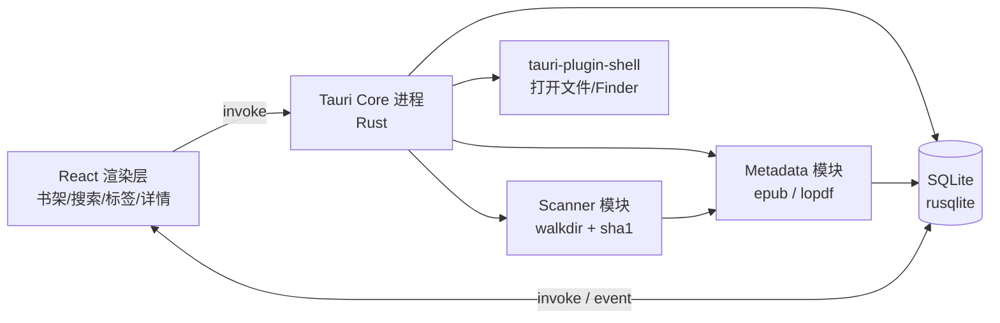

# 本地电子书管理工具


## **一、项目概览**

**产品名称**：BookShelf

**目标平台**：macOS（Universal）

**核心功能**：
- 扫描指定目录下的 `.epub` / `.pdf` 文件，建立图书索引列表
- 支持批量打标签（Tag）
- 按 Tag 浏览、按书名搜索
- 对每本书做个人化标注：评分、是否看过、喜好程度、笔记文件链接、备注等
- 双击可用系统默认应用打开图书

**非目标（一期不做）**：云同步、在线书城、内置阅读器、OCR。

**预期产物体积**：DMG 约 8\~12 MB，安装后约 25 MB。

---

## **二、技术选型**

| 层 | 选型 | 说明 |
|---|---|---|
| 应用框架 | **Tauri 2.x** | 系统 WebView 渲染 + Rust 后端 |
| 后端语言 | **Rust（stable）** | 文件系统、解析、SQLite 调用 |
| 前端框架 | **React 18 + TypeScript + Vite** | 与原方案一致，UI 代码可平滑迁移 |
| 样式 | **Tailwind CSS** | 快速搭建 macOS 风格 UI |
| 状态管理 | **Zustand** | 轻量，AI 友好 |
| 数据库 | **SQLite**（通过 `tauri-plugin-sql` 或 `rusqlite`） | 本地单文件 |
| EPUB 解析 | **`epub` crate** + 必要时手写 OPF 解析 | 提取标题/作者/封面 |
| PDF 解析 | **`lopdf`** 或 **`pdf` crate** | 读取 Info 字典 |
| 打包 | **Tauri CLI（tauri build）** | 直接产出 `.dmg`/`.app` |

---

## **三、整体架构**



模块划分（Rust 侧）：
- **`scanner`**：递归扫描目录，过滤扩展名，计算文件哈希用于去重。
- **`metadata`**：EPUB（`OPF` 解析）和 PDF（Info 字典）元数据 + 封面提取。
- **`repository`**：封装 `rusqlite` 读写，所有业务通过它访问数据。
- **`tag_service`**：标签 CRUD、批量打标。
- **`search_service`**：基于 SQLite FTS5 做书名/作者全文搜索。
- **`commands`**：通过 `#[tauri::command]` 暴露给前端的入口函数集合。

UI 层模块与原方案一致：书架视图、标签侧栏、详情面板、批量操作工具栏。

---

## **四、数据模型设计（SQLite）**

数据模型与原方案完全一致，可直接复用：

```sql
-- 图书主表
CREATE TABLE books (
  id            INTEGER PRIMARY KEY AUTOINCREMENT,
  file_path     TEXT NOT NULL UNIQUE,
  file_hash     TEXT,
  format        TEXT,
  title         TEXT NOT NULL,
  author        TEXT,
  cover_path    TEXT,
  file_size     INTEGER,
  added_at      DATETIME DEFAULT CURRENT_TIMESTAMP,
  rating        INTEGER CHECK(rating BETWEEN 0 AND 5) DEFAULT 0,
  is_read       INTEGER DEFAULT 0,
  liked         INTEGER,
  note_link     TEXT,
  remark        TEXT
);

CREATE TABLE tags (
  id    INTEGER PRIMARY KEY AUTOINCREMENT,
  name  TEXT NOT NULL UNIQUE,
  color TEXT
);

CREATE TABLE book_tags (
  book_id INTEGER REFERENCES books(id) ON DELETE CASCADE,
  tag_id  INTEGER REFERENCES tags(id)  ON DELETE CASCADE,
  PRIMARY KEY (book_id, tag_id)
);

CREATE VIRTUAL TABLE books_fts USING fts5(title, author, content=books, content_rowid=id);
```

数据库文件存放路径推荐：`$APPDATA/bookshelf/library.db`，通过 Tauri 的 `app_data_dir()` 获取，跨平台一致。

---

## **五、核心流程规格**

### **1. 目录扫描（Rust 侧）**
- **入口命令**：`#[tauri::command] async fn scan_directory(root: String, app: AppHandle) -> Result<ScanReport, String>`
- **目录选择**：前端通过 `tauri-plugin-dialog` 的 `open({ directory: true })` 拉起系统选择器，把路径传给后端。
- **遍历**：使用 `walkdir` crate，过滤扩展名 `.epub` / `.pdf`。
- **哈希**：用 `sha1` crate 对文件前 1MB 计算 SHA1，兼顾性能与准确性。
- **去重**：同 `file_hash` 不同 `file_path` → 视为移动，UPDATE 路径而非 INSERT。
- **进度回传**：通过 `app.emit("scan-progress", payload)` 主动推送给前端，前端用 `listen('scan-progress', ...)` 订阅。

### **2. 元数据提取**
- **EPUB**：使用 `epub` crate（`EpubDoc::new`）读取 `metadata("title")`、`metadata("creator")`，通过 `get_cover()` 取出封面字节流写入本地缓存目录。如解析失败，回落到自行解压 `META-INF/container.xml` + OPF 的方案（用 `zip` + `quick-xml` crate）。
- **PDF**：使用 `lopdf::Document::load`，从 `trailer` → `Info` 字典提取 `/Title`、`/Author`；若无标题则取文件名去扩展名。封面可选：用 `pdfium-render`（需要带 PDFium 动态库）或暂时跳过。
- **封面缓存**：写入 `app_data_dir()/covers/{book_title}.jpg`。

### **3. 批量打标签**
- **前端**：选中多本 → 调用 `invoke('add_tags_to_books', { bookIds, tagIds })`。
- **后端命令**：开启一次 `Transaction`，批量执行 `INSERT OR IGNORE INTO book_tags`，提交后返回受影响数量。

### **4. 浏览与搜索**
- **侧栏标签**：`invoke('list_tags_with_count')` 返回 `[{ id, name, color, count }]`。
- **搜索**：`invoke('search_books', { keyword, tagIds, filter })`，Rust 侧根据是否有 keyword 在 `books_fts MATCH ?` 与 `LIKE '%kw%'` 之间切换。中文分词建议用 `LIKE` 兜底，或集成 `tantivy` + `jieba-rs`（成本较高，二期再考虑）。
- **主区域**：网格视图（封面）/ 列表视图（表格）切换。

### **5. 个人标注**
- 单字段更新走通用命令：`invoke('update_book_field', { bookId, field, value })`，Rust 侧白名单字段防注入。
- `note_link` 点击：前端调用 `tauri-plugin-shell` 的 `open(path_or_url)`，本地路径与 URL 都能处理。

### **6. 打开文件 / Finder 揭示**
- 双击书籍 → `shell.open(file_path)`（系统默认应用）。
- 右键"在 Finder 中显示" → `tauri-plugin-opener` 的 `reveal_item_in_dir` 或调用 `Command::new("open").args(["-R", path])`。

---

## **六、UI 设计要点**

UI 部分：三栏布局（左标签/中列表/右详情可折叠）、主操作栏（扫描/刷新/批量打标/批量已读/删除仅删记录）、封面缺失用首字母占位、双击打开、右键菜单。


---

## **七、目录结构建议**

```
bookshelf/
├── src-tauri/                    # Rust 后端
│   ├── src/
│   │   ├── main.rs               # Tauri 入口，注册 commands 与 plugins
│   │   ├── commands/             # #[tauri::command] 集合
│   │   │   ├── books.rs
│   │   │   ├── tags.rs
│   │   │   └── scan.rs
│   │   ├── services/
│   │   │   ├── scanner.rs
│   │   │   ├── metadata.rs
│   │   │   ├── repository.rs
│   │   │   └── search.rs
│   │   ├── db/
│   │   │   ├── schema.sql
│   │   │   └── migrations.rs
│   │   └── models.rs             # 与前端共享的 struct（serde）
│   ├── Cargo.toml
│   ├── tauri.conf.json           # 应用配置、权限、打包参数
│   └── icons/
├── src/                          # React 前端
│   ├── pages/
│   ├── components/
│   ├── hooks/
│   ├── store/                    # Zustand
│   └── api/                      # invoke 封装层（类型与 models.rs 对齐）
├── index.html
├── vite.config.ts
└── package.json
```

---

## **八、关键依赖清单**

**前端 `package.json`**：

```json
{
  "dependencies": {
    "@tauri-apps/api": "^2",
    "@tauri-apps/plugin-dialog": "^2",
    "@tauri-apps/plugin-shell": "^2",
    "@tauri-apps/plugin-opener": "^2",
    "react": "^18",
    "zustand": "^4"
  },
  "devDependencies": {
    "@tauri-apps/cli": "^2",
    "typescript": "^5",
    "vite": "^5",
    "tailwindcss": "^3"
  }
}
```

**后端 `src-tauri/Cargo.toml`** 关键 crate：

```toml
[dependencies]
tauri = { version = "2", features = [] }
tauri-plugin-dialog = "2"
tauri-plugin-shell = "2"
tauri-plugin-opener = "2"
serde = { version = "1", features = ["derive"] }
serde_json = "1"
rusqlite = { version = "0.31", features = ["bundled", "trace"] }
walkdir = "2"
sha1 = "0.10"
epub = "2"
lopdf = "0.32"
zip = "0.6"
quick-xml = "0.31"
tokio = { version = "1", features = ["full"] }
anyhow = "1"
thiserror = "1"
```

`rusqlite` 的 `bundled` feature 会把 SQLite 静态编译进二进制，省去用户环境依赖。FTS5 默认启用。

---

## **九、权限与配置（`tauri.conf.json`）**

Tauri 2.x 用细粒度的 capability 文件控制权限。最少需要：

- `dialog:allow-open` —— 选择目录
- `shell:allow-open` —— 打开图书与笔记链接
- `opener:allow-reveal-item-in-dir` —— 在 Finder 中显示
- `fs:allow-read-dir` / `fs:allow-read-file`（限定到用户选择的根目录）

打包参数建议：

```json
{
  "bundle": {
    "active": true,
    "targets": ["dmg", "app"],
    "macOS": { "category": "public.app-category.productivity" }
  }
}
```

自用免公证，发布前可签名以避免 Gatekeeper 警告。

---

## **十、开发里程碑**

**M1（1\~2 天）**：Tauri 脚手架（`npm create tauri-app`）、SQLite 初始化、目录选择 + 扫描 + 入库（仅文件名），书架列表展示。

**M2（2\~3 天）**：EPUB/PDF 元数据与封面解析、去重逻辑、增量扫描、扫描进度事件流。

**M3（1\~2 天）**：标签系统（创建、批量打标、按 Tag 过滤、计数侧栏）。

**M4（1\~2 天）**：FTS5 搜索（中文 LIKE 兜底）、详情面板与个人标注字段（评分、已读、喜欢、笔记链接、备注）。

**M5（1 天）**：右键菜单、双击打开、Finder 揭示、UI 打磨、`tauri build` 打包出 DMG。

总工期约一周，与原方案持平；额外的 Rust 学习/调试时间靠 AI 协助可大幅压缩。

---

## **十一、给 AI 编码助手的提示词模板**

把这份文档作为系统上下文后，可用如下 Prompt 启动每个迭代：

> 我正在用 **Tauri 2.x + Rust + React + TypeScript + rusqlite** 开发一个 macOS 本地电子书管理工具。请按照下面的数据模型和模块边界（贴入第三、第四节）实现 `src-tauri/src/services/scanner.rs`，要求：递归扫描指定目录、过滤 epub/pdf、用 sha1 对文件前 1MB 计算哈希、通过 `AppHandle::emit("scan-progress", ...)` 上报进度、调用 `repository` 写入 SQLite。同时给出对应的 `#[tauri::command] async fn scan_directory(...)` 命令、前端 `invoke` 封装与 React 组件中订阅事件的示例代码。请使用 Tauri 2.x 的最新 API（不要使用 1.x 的 `tauri::Manager::emit_all`，应使用 `Emitter` trait 的 `emit`）。

按里程碑逐步让 AI 产出代码，每完成一段就 `cargo check` + 跑通再进入下一段。**特别提醒 AI 明确使用 Tauri 2.x 的 API**，避免它混用 1.x 的旧写法（这是当前最常见的坑）。

---

## **十二、相对 Electron 版本的关键差异速查**

| 维度 | Electron 版 | Tauri 版 |
|---|---|---|
| 主进程语言 | Node.js / TS | Rust |
| IPC 调用 | `ipcRenderer.invoke` | `invoke()` + `#[tauri::command]` |
| 目录选择 | `dialog.showOpenDialog` | `tauri-plugin-dialog` |
| 打开文件 | `shell.openPath` | `tauri-plugin-shell` |
| SQLite | `better-sqlite3` | `rusqlite`（bundled） |
| EPUB 解析 | `epub2`（成熟） | `epub` crate（基础，可能要补 OPF 手写） |
| PDF 解析 | `pdf-parse`（成熟） | `lopdf`（够用，封面需 `pdfium-render`） |
| 打包工具 | `electron-builder` | `tauri build` |
| DMG 体积 | ~100 MB | **~10 MB** |
| 编译速度 | 秒级 | 首次分钟级，增量秒级 |

---

按以上指南推进，一周左右就能拿到一个**安装包仅 10MB 出头、启动秒开、内存占用比 Electron 低 3\~5 倍**的本地电子书管理器。一期跑通后，二期可考虑接入 `epub.js` 内嵌阅读器、阅读进度同步、按作者/系列自动归类等增强功能。